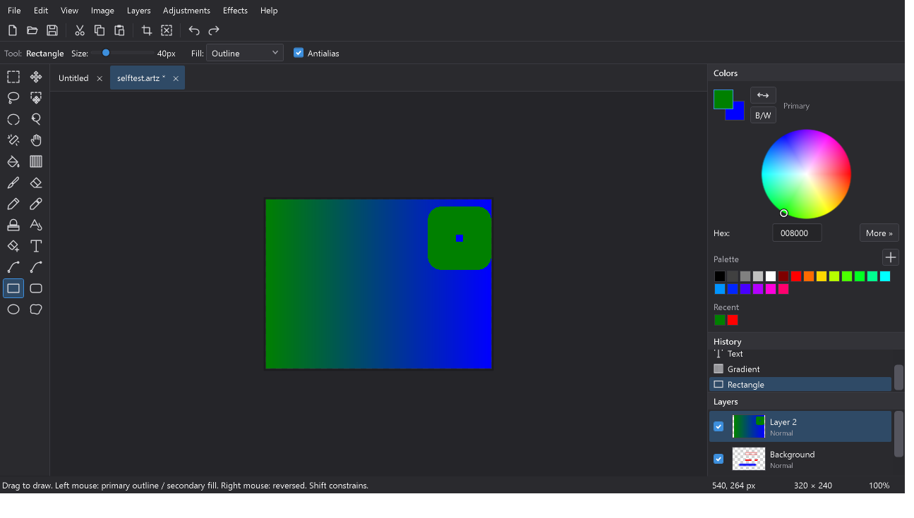

# Artista

A personal, Paint.NET-style raster image editor for Windows, built from scratch in **C# / WPF on .NET 10**. The workspace, tools, shortcuts and interaction model intentionally mirror Paint.NET 5.x, with a fully themeable UI (complete dark mode), a layered native project format, and a first-class **Remove Color** system (global effect + brush tool) built on a perceptual OKLab color engine.



## Feature set

- **Documents**: new (transparent / white / color background), open, save, save-as, export, multiple tabbed documents, unsaved-change indicators and close confirmation, recent files, drag-and-drop Open/Add-layer choice, clipboard cut/copy/paste and paste-into-new-image, oversized-paste Expand/Keep-canvas choice, resize image, resize canvas (anchored), rotate 90/180, flip, crop to selection, image properties, configurable defaults.
- **Formats**: PNG, JPEG, BMP, GIF, TIFF (WebP decodes when the Windows codec is installed; WIC cannot encode WebP). Native layered project format **`.artz`** (documented in `docs/PROJECT_FORMAT.md`).
- **Canvas**: checkerboard transparency, cursor-centered wheel zoom (3%–6400%), fit-to-window / actual size, smooth panning (Space+drag, middle-drag, Pan tool), scrollbars, pixel grid at high zoom, optional rulers, animated marching-ants selection outline, live tool previews.
- **Layers**: add / delete / duplicate / rename / reorder (buttons + drag), merge down, flatten, visibility, opacity, lock, alpha-lock, thumbnails, blend modes (Normal, Multiply, Screen, Overlay, Darken, Lighten, Difference, Additive).
- **History**: unlimited undo/redo with named entries, history panel with click-to-jump, one entry per stroke / effect, region-delta storage with a configurable memory budget (default 512 MB).
- **Selections**: rectangle, ellipse, lasso, magic wand (tolerance, contiguous/global), select all / deselect / invert, add/subtract/intersect combine modes (Ctrl/Alt while dragging), feathering, move selected pixels, move selection outline; all tools and effects respect the selection mask with antialiased edges.
- **Tools** (24): Rectangle/Ellipse/Lasso Select, Magic Wand, Move Selected Pixels, Move Selection, Zoom, Pan, Paintbrush, Pencil, Eraser, Paint Bucket, Gradient (linear/radial), Color Picker, Clone Stamp, Recolor, **Color Remover**, Text, Line, Curve, Rectangle, Rounded Rectangle, Ellipse, Freeform Shape.
- **Adjustments**: Auto Level, Black & White, Brightness/Contrast, Curves (editable spline, per-channel), Hue/Saturation, Invert Colors, Levels, Posterize, Sepia, Transparency.
- **Effects**: Gaussian Blur, Motion Blur, Sharpen, Add Noise, Reduce Noise, Pixelate, Outline, Drop Shadow, Glow, Emboss, Edge Detect, Vignette, **Remove Color** — all with auto-generated dialogs, live preview, cancel-restores-exact-original, selection masking, and single undo entries.
- **Remove Color** (Effects → Transparency → Remove Color): target color with canvas eyedropper, tolerance (0 = exact RGB match only), edge-softness alpha falloff, scope (current layer / all visible / all incl. hidden), limit-to-selection, proportional alpha preservation. Perceptual OKLab matching shared with the Color Remover brush.
- **Themes**: Dark / Light / Follow Windows — themes every surface including menus, dialogs, context menus, scrollbars and title bars; persisted in settings.

## Requirements

- Windows 10/11
- .NET SDK 10.0 (to build) — the .NET 10 Desktop Runtime is enough to run a published build.
  If `dotnet` is not on PATH, the scripts below also look in `%LOCALAPPDATA%\Microsoft\dotnet`.

## Build, test, run

```cmd
build.cmd        :: dotnet build Artista.slnx -c Release
test.cmd         :: dotnet test tests\Artista.Tests -c Release   (82 core tests)
run.cmd          :: builds then starts the app
```

Exact commands, if you prefer them raw:

```cmd
dotnet build Artista.slnx -c Release
dotnet test tests\Artista.Tests\Artista.Tests.csproj -c Release
dotnet run --project src\Artista.App -c Release
```

**Compiled executable:** `src\Artista.App\bin\Release\net10.0-windows\Artista.exe`
(Debug builds land in `bin\Debug\net10.0-windows\Artista.exe`.)

There is also an automated UI smoke test that drives the real window through 86 checks (documents, tools, effects, undo, save/reopen, themes, menus, dialogs, exact-corner canvas panning, layer targeting, oversized paste, drag/drop, clipboard alpha, selection cancellation, and floating panels):

```cmd
src\Artista.App\bin\Release\net10.0-windows\Artista.exe --uitest %TEMP%\artista-uitest
:: exit code 0 = all passed; report + step screenshots in the output folder
```

## Documentation

- `docs/ARCHITECTURE.md` — solution layout and how the pieces fit
- `docs/ADDING_A_TOOL.md` — step-by-step: add a new canvas tool
- `docs/ADDING_AN_EFFECT.md` — step-by-step: add a new effect/adjustment
- `docs/PROJECT_FORMAT.md` — the `.artz` file format
- `docs/BUILDING.md` — environment setup details
- `docs/KEYBOARD_SHORTCUTS.md` — full shortcut list (also in-app: Help → Keyboard Shortcuts / F1)
- `docs/AUDIT_2026-08-04.md` — compatibility and integrity audit covering canvas, layers, paste, drag/drop, history, and save workflows

## Settings

`%AppData%\Artista\settings.json` — theme, default document size/background, recent files, saved palette, JPEG quality, history memory limit.

## Known limitations

- **WebP** decodes only (Windows has no WIC WebP *encoder*); save as PNG instead.
- **`.pdn` files** are not supported — the historical OpenPDN codebase (in `OpenPDN-master/`) served as a UX reference only; `.artz` is the native layered format.
- The **Line/Curve** tool draws straight lines; the separate **Curve** tool places up to 8 spline points (Enter commits). Shape handles cannot be re-edited after the mouse is released.
- **Clone Stamp** samples the layer as it was at stroke start (self-overlapping strokes within one drag read the pre-stroke pixels).
- Selection edges are antialiased; the marching-ants outline traces the 50% coverage boundary.
- Printing is not implemented (export to PNG and print from any viewer).
